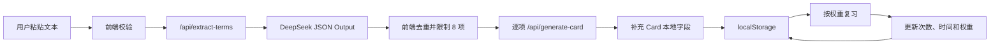

# 设计思路

## 1. 为什么做这个项目

TechLex 来自一个具体痛点：很多开发者读得懂英文技术文档，却难以在代码注释、commit message 和技术写作中主动使用其中的表达。TechLex 把阅读、术语提取、卡片生成和复习串成一个连续动作。

它不替代 Anki、语言学习产品或 Notion：Anki 擅长调度但通常需要手工制卡；通用语言产品不聚焦技术表达；笔记工具不会自动生成卡片和复习队列。

## 2. 核心设计决策

### 2.1 先支持粘贴文本

- **决策**：MVP 只提供文本粘贴入口。
- **理由**：可以覆盖 README、API 文档和博客，同时避免文件类型、编码和解析问题。
- **取舍**：长文档和文件导入留给后续版本。

### 2.2 使用 localStorage

- **决策**：卡片库和复习状态保存在浏览器。
- **理由**：无需账号、数据库和后端数据层，适合验证个人学习闭环。
- **取舍**：不能跨设备同步，清理浏览器数据会丢失卡片。

### 2.3 Prompt 文档与运行模板分离

- `prompts/` 记录目标、设计理由、示例和迭代历史。
- `server/promptTemplates.js` 保存实际执行模板。
- 修改输出契约时必须同时更新文档、运行模板、校验代码和测试。

### 2.4 两阶段 AI 流程

先提取术语，再逐个生成卡片。提取阶段评估“是否值得学”，生成阶段评估“解释是否准确且贴合语境”。顺序生成最多 8 张卡片，降低限流和部分失败的复杂度。

### 2.5 使用服务端函数保护密钥

React 只调用同源 `/api`。Vercel Function 读取 `DEEPSEEK_API_KEY` 并调用 DeepSeek。任何 `VITE_*` 环境变量都会暴露给浏览器，因此绝不保存 API Key。

开发阶段可以设置 `VITE_USE_MOCK_API=true`，先验证 UI、异步流程、存储和复习，不产生 API 费用。

## 3. 数据结构

```json
{
  "id": "uuid",
  "term": "idempotent",
  "definition": "Producing the same result when repeated.",
  "example": "The endpoint is idempotent and safe to retry.",
  "context": "Used when discussing API retry behavior.",
  "sourceSentence": "PUT requests should be idempotent.",
  "createdAt": "2026-06-14T00:00:00.000Z",
  "reviewWeight": 1,
  "wrongCount": 0,
  "correctCount": 0,
  "lastReviewedAt": null
}
```

localStorage 键为 `techlex.cards.v1`。使用版本化键名，为未来迁移保留空间。去重键由标准化后的 `term + sourceSentence` 组成，避免错误合并同一术语的不同语境。

## 4. 接口

### `POST /api/extract-terms`

输入：

```json
{ "text": "English technical text" }
```

输出：

```json
{
  "terms": [
    {
      "term": "idempotent",
      "context_sentence": "PUT requests should be idempotent."
    }
  ]
}
```

### `POST /api/generate-card`

输入：

```json
{
  "term": "idempotent",
  "context_sentence": "PUT requests should be idempotent."
}
```

输出卡片的 `term`、`definition`、`example` 和 `context`。本地字段由前端程序补充。

错误统一为：

```json
{
  "error": {
    "code": "RATE_LIMITED",
    "message": "请求过于频繁，请稍后重试。"
  }
}
```

## 5. 核心流程



## 6. 复习规则

- 新卡片权重为 `1`。
- 答错：权重 `+1`，最高 `5`。
- 答对：权重乘 `0.75`，最低 `0.25`。
- 抽题按权重随机，并在卡片数大于 1 时跳过刚出现的卡片。
- 这是可解释的 MVP 启发式，不是完整 SM-2 算法。

## 7. 已知限制

- localStorage 不提供云同步和可靠备份。
- DeepSeek 输出仍需校验；JSON Output 也可能返回空内容。
- 公开 API 仍需进一步加入滥用控制和费用限额。
- 暂不支持文件、URL、账号、数据库和多模型切换。
