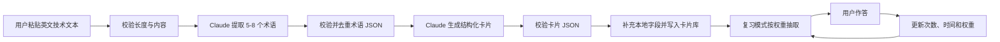

# 设计思路

## 1. 为什么做这个项目

TechLex 来自一个具体的学习痛点：阅读英文技术文档时，很多术语能够看懂，却很难在代码注释、commit message 或技术写作中主动使用。手工摘录和整理会打断阅读，久而久之术语只停留在“认识”阶段。

TechLex 希望把“阅读技术内容”和“积累专业英语”合并成一个连续动作：用户粘贴正在阅读的文本，系统提取值得学习的术语，生成带原文语境的卡片，并通过复习把被动词汇转化为主动词汇。

它与常见工具的侧重点不同：

- Anki 擅长记忆调度，但卡片通常需要手工制作，TechLex 负责从技术文本到卡片的生成过程。
- 多邻国等语言学习产品覆盖通用场景，TechLex 聚焦软件开发和技术写作中的垂直表达。
- Notion 适合整理资料，但不会主动提取术语、生成结构化卡片或安排复习。

TechLex 不尝试替代这些工具。第一阶段只验证一条最短闭环：输入真实技术文本，生成可复习的术语卡片。

## 2. 核心设计决策

### 2.1 为什么是“粘贴文本”而不是“上传文件”

- **决策**：MVP 只提供文本粘贴入口。
- **理由**：文本框可以覆盖 README、API 文档、博客和代码注释等主要来源，同时避免处理文件类型、编码、大小限制和解析失败。
- **取舍**：用户需要先复制内容，长文档体验有限。`.txt`、`.md`、PDF 和 URL 导入留给后续版本。

### 2.2 为什么用 localStorage 而不是数据库

- **决策**：卡片库和复习状态保存在浏览器 localStorage。
- **理由**：一周 MVP 不需要后端、账号系统和数据库部署；数据留在本地也符合个人学习工具的定位。
- **取舍**：数据不能自动跨设备同步，清理浏览器数据可能造成丢失，容量也有限。导入导出和云同步应在验证使用频率后再考虑。

### 2.3 为什么把 Prompt 独立成文件

- **决策**：术语提取和卡片生成 Prompt 作为 `prompts/` 下的独立资产维护，业务代码只负责组装输入、调用模型和校验输出。
- **理由**：Prompt 的目标、格式约束、示例和迭代原因需要被审查；独立文档比散落在字符串中的模板更容易比较和优化。
- **取舍**：浏览器构建时不能直接依赖 Markdown 文档作为运行时配置。MVP 可以在代码中维护与文档同步的模板，后续再引入构建期加载或独立 Prompt 配置层。

### 2.4 为什么拆成“提取术语”和“生成卡片”两步

- **决策**：先从整段文本筛选术语，再针对每个术语生成卡片。
- **理由**：两个任务的评估标准不同。提取阶段关注“哪些内容值得学”，生成阶段关注“解释是否准确、是否保留语境”。拆分后可以单独重试、缓存和迭代。
- **取舍**：两阶段会增加 API 请求次数和延迟。MVP 以可观察性和输出质量优先，后续可通过批量生成卡片降低调用成本。

### 2.5 API Key 的边界

- **决策**：仓库不包含真实 API Key，用户通过 `.env` 或本地设置提供自己的 Key。
- **理由**：避免凭证泄露和公共额度滥用。
- **限制**：纯前端直接调用第三方模型 API 无法真正隐藏 Key。公开部署前必须确认供应商是否允许浏览器调用；面向非技术用户时，应改为受控的服务端代理。

## 3. 数据结构设计

### 3.1 卡片 Card

```json
{
  "id": "uuid",
  "term": "idempotent",
  "definition": "Producing the same result when an operation is applied repeatedly.",
  "example": "The endpoint is idempotent, so retrying the request does not create another resource.",
  "context": "Use this term when describing APIs or operations that are safe to repeat.",
  "sourceSentence": "PUT requests are expected to be idempotent.",
  "createdAt": "2026-06-13T12:00:00.000Z",
  "reviewWeight": 1,
  "wrongCount": 0,
  "correctCount": 0,
  "lastReviewedAt": null
}
```

字段约定：

| 字段 | 类型 | 说明 |
|---|---|---|
| `id` | string | 本地唯一标识，建议使用 `crypto.randomUUID()` |
| `term` | string | 术语或固定技术表达 |
| `definition` | string | 面向技术学习者的简洁英文定义 |
| `example` | string | 与原文语境相关的新例句 |
| `context` | string | 该表达常见的工程应用场景 |
| `sourceSentence` | string | 提取术语时保留的原文句子，用于追溯语境 |
| `createdAt` | ISO timestamp | 卡片创建时间 |
| `reviewWeight` | number | 抽题权重，MVP 初始值为 `1` |
| `wrongCount` | number | 累计答错次数 |
| `correctCount` | number | 累计答对次数 |
| `lastReviewedAt` | ISO timestamp/null | 最近一次复习时间 |

### 3.2 术语提取中间结果

```json
{
  "terms": [
    {
      "term": "idempotent",
      "context_sentence": "PUT requests are expected to be idempotent."
    }
  ]
}
```

该对象不直接存入卡片库，而是作为卡片生成阶段的输入。程序必须校验 `terms` 是数组，且每项都包含非空的 `term` 和 `context_sentence`。

### 3.3 本地存储

- 存储键：`techlex.cards.v1`
- 存储值：序列化后的 `Card[]`
- 版本号放入键名，避免未来字段迁移时覆盖旧数据。
- 所有读取都应提供空数组回退，并处理 JSON 损坏或 localStorage 不可用的情况。

## 4. 核心流程



失败处理遵循“保留用户输入、说明失败阶段、允许重试”的原则。模型返回不能直接视为可信数据，进入状态或 localStorage 前必须解析和校验。

## 5. 复习权重的 MVP 规则

第一版不实现完整 SM-2 算法，只验证“答错内容更快再次出现”：

- 新卡片权重为 `1`。
- 答错：`wrongCount + 1`，权重增加，最高不超过 `5`。
- 答对：`correctCount + 1`，权重降低，最低保持 `0.25`。
- 每次作答更新 `lastReviewedAt`。
- 抽题时按权重随机，而不是简单按数组顺序随机。

权重只表达相对优先级，不等同于严格的复习日期。稳定版本需要加入间隔、熟练度和到期时间字段，并通过实际数据校准参数。

## 6. 已知限制 / 暂不解决的问题

- MVP 依赖用户自行提供 Claude API Key；纯前端场景存在 Key 暴露风险。
- 模型输出可能不符合 JSON 约定，需要校验、错误提示和有限重试。
- 同一个术语可能在不同语境中重复出现，第一版只做大小写归一化后的简单去重。
- localStorage 不提供云同步、可靠备份和多设备使用能力。
- 复习算法是启发式权重，不是经过学习效果验证的间隔重复算法。
- 暂不解析上传文件、PDF 或网页 URL。
- 暂不支持多人协作、账号系统、服务端卡片库和日常英语词汇。

